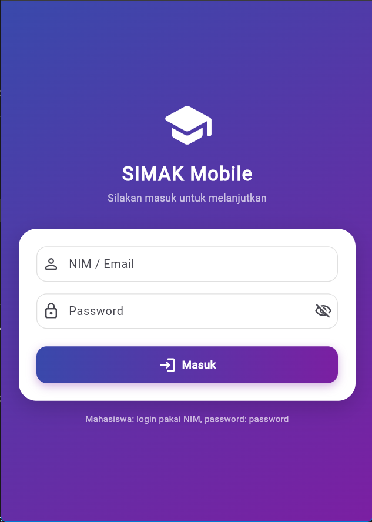
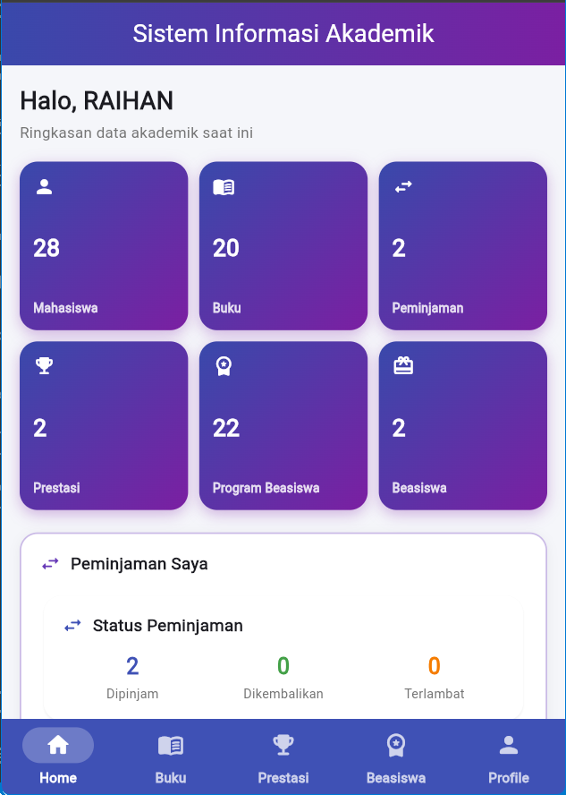
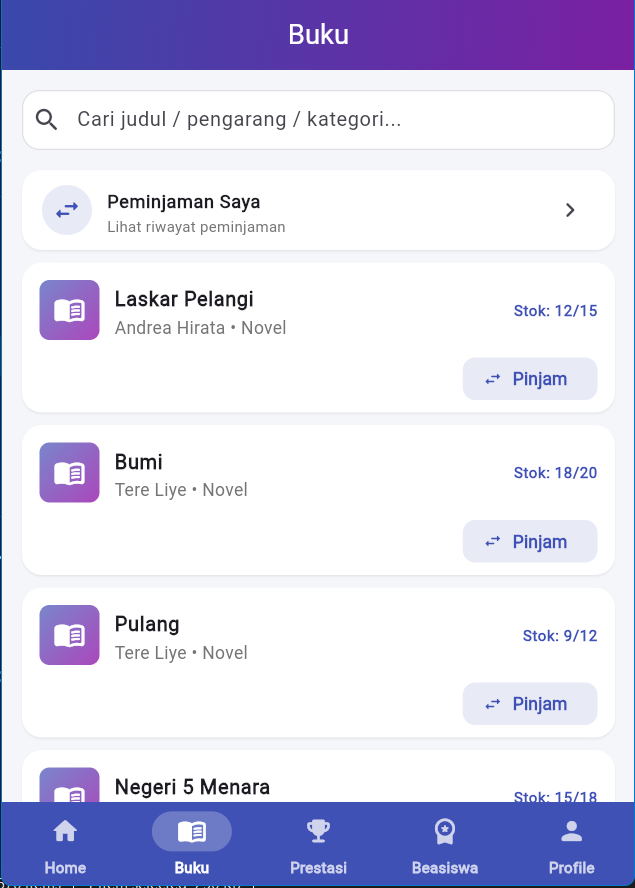
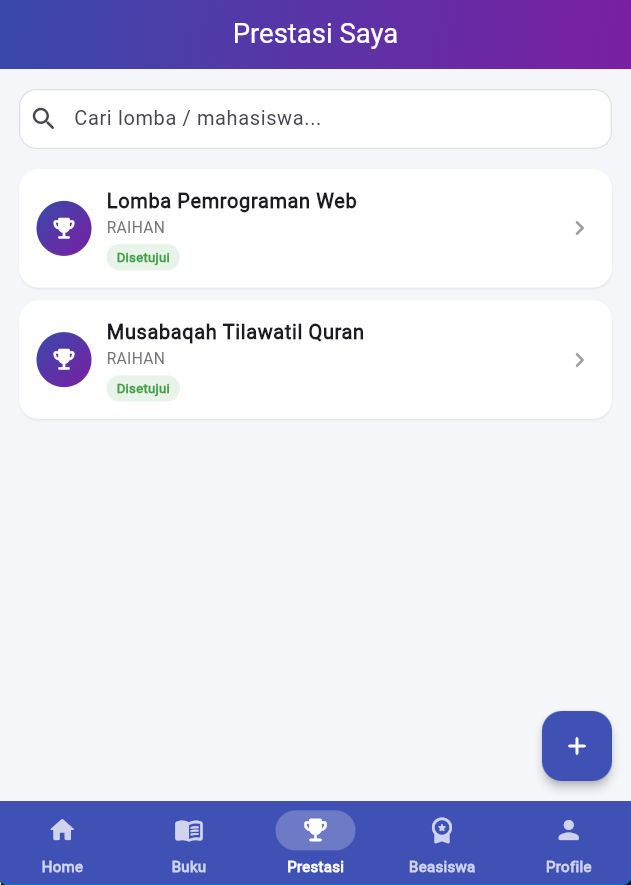
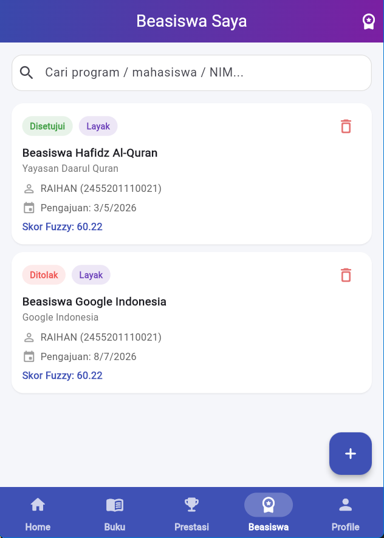
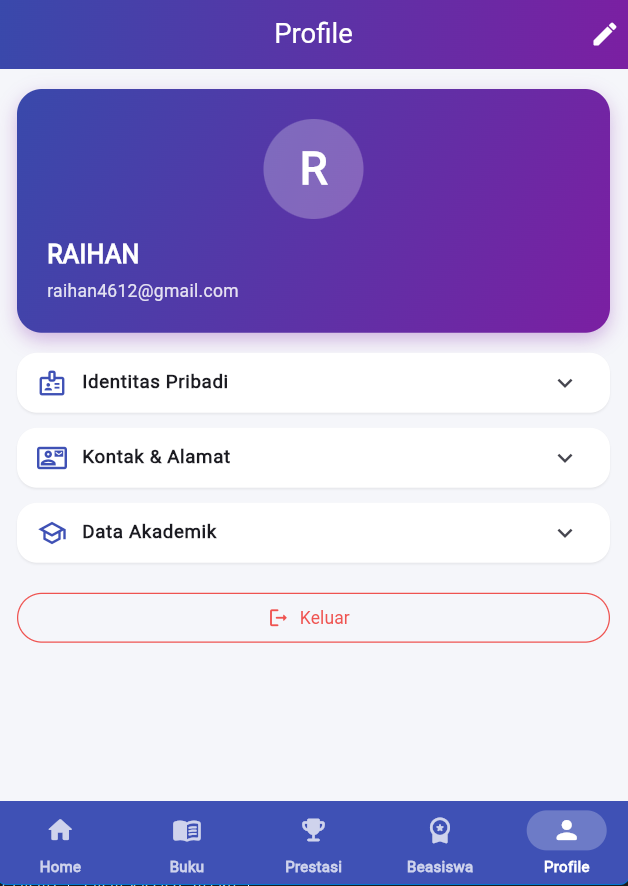

<p align="center">
  
</p>

<h1 align="center">SIMAK Mobile</h1>

<p align="center">
  <b>Sistem Informasi Mahasiswa</b> — akses data akademik, perpustakaan, prestasi, dan beasiswa dalam satu aplikasi mobile.
</p>

<p align="center">
  Dibangun dengan <b>Flutter</b>, didukung backend <b>Laravel</b>, dan rekomendasi beasiswa berbasis logika <b>Fuzzy Mamdani</b>.
</p>

---

## Screenshot

| Login | Dashboard | Perpustakaan |
|:---:|:---:|:---:|
|  |  |  |

| Prestasi | Beasiswa | Profil |
|:---:|:---:|:---:|
|  |  |  |

## Fitur Utama

- **Autentikasi aman** — login dengan NIM/email + password, token Bearer (Laravel Sanctum), password ter-hash bcrypt.
- **Dashboard statistik** — ringkasan buku dipinjam, status prestasi, dan pengajuan beasiswa secara real-time.
- **Katalog & peminjaman buku** — cari buku, catat pinjam/kembali, denda keterlambatan (Rp 1.000/hari) dihitung otomatis.
- **Input & verifikasi prestasi** — unggah sertifikat dari kamera/galeri, alur verifikasi berjenjang (Pending → Disetujui/Ditolak).
- **Pengajuan & rekomendasi beasiswa** — rekomendasi otomatis berbasis logika **Fuzzy Mamdani** (IPK + tingkat prestasi).
- **Profil & pengaturan akun** — kelola data diri dan perbarui password.
- **RBAC** — empat level pengguna: Admin, Petugas, Mahasiswa, dan Guest.

## Teknologi

| Bagian | Teknologi |
| --- | --- |
| Frontend Mobile | Flutter, Dart, Provider, Dio, SharedPreferences, Intl |
| Backend | Laravel, PHP 8.3, Laravel Sanctum, Eloquent ORM, REST API |
| Database | MySQL |
| Algoritma | Fuzzy Mamdani (rekomendasi beasiswa) |

## Arsitektur

```
SIMAK Mobile (Flutter / Android)
        │  HTTPS · JSON API (token Sanctum)
        ▼
Backend Laravel 13 (REST API · RBAC · Fuzzy Mamdani)
        │
        ▼
Database MySQL
```

## Instalasi & Menjalankan

### Cara 1 — Instal APK (Android)

1. Unduh file `simak-mobile.apk` dari halaman landing/unduhan.
2. Buka file APK; jika muncul peringatan, izinkan **"Instal aplikasi tidak dikenal"**.
3. Tekan **Instal** dan tunggu hingga selesai.
4. Buka aplikasi lalu login.

### Cara 2 — Build dari source

```bash
# 1. Persiapkan backend (folder praktikum24)
cd ../praktikum24
composer install
cp .env.example .env   # sesuaikan konfigurasi database
php artisan key:generate
php artisan migrate --seed
php artisan serve      # API aktif di http://localhost:8000

# 2. Jalankan aplikasi Flutter
cd ../simak_mobile
flutter pub get
flutter run

# build APK release
flutter build apk --release
```

> Untuk perangkat fisik, arahkan API ke server Anda saat build:
> `flutter build apk --release --dart-define=API_URL=http://IP-SERVER:8000/api`

### Akun Uji Coba

| Peran | Login | Password |
| --- | --- | --- |
| Admin | `admin@simak.com` | `admin123` |
| Petugas | `petugas@simak.com` | `petugas123` |
| Mahasiswa | NIM | `password` |

## Struktur Project

```
lib/
├── core/          # API client, tema, widget umum
├── data/
│   ├── models/    # Model data (mahasiswa, buku, prestasi, beasiswa, ...)
│   ├── providers/ # State management (Provider)
│   └── repositories/ # Layer akses data
└── screens/       # Halaman (login, dashboard, buku, prestasi, beasiswa, profil)
```

## Repositori Terkait

- **Landing page**: folder `landingpage/` pada repositori ini.
- **Backend / Web Admin**: folder `praktikum24/` pada repositori ini.
